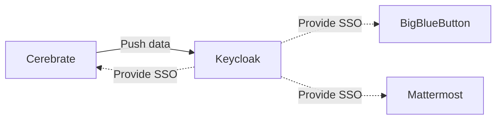
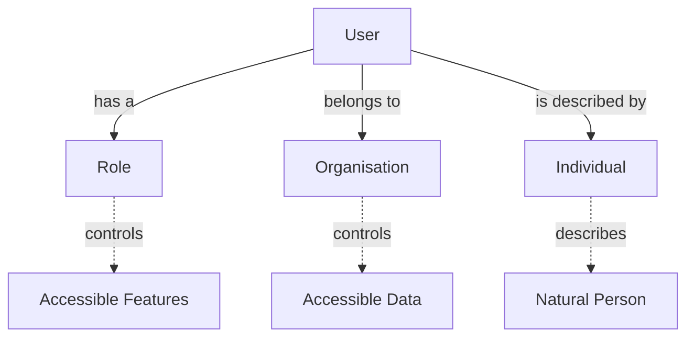

# Administration

## Keycloak integration

Cerebrate can be used in standalone mode, where it authenticates and manages its own users. This happens to be also the default configuration after installation, but you are not limited to leaving Cerebrate in this mode of operation.

By enabling Keycloak as your authentication provider, you can rely on Keycloak for authentications, whilst still benefiting from all the user management offered by Cerebrate.

This will lead to Cerebrate pushing changes to Keycloak and maintaining the state of your users.

- Users are **created in Cerebrate** and then automatically **provisioned in Keycloak**
- Other services (including Cerebrate) can **rely on keycloak for authentication** purposes
- **Cerebrate is the user management interface** to create users and revoke their access
    - Keycloak should not be access directly
- User permissions for other tools are managed via permission flags encoded as User Meta-fields in Cerebrate
    - Manage the available permissions

## Keycloak configuration

- As a first step, create a Realm with OpenID endpoint configuration
    - The realm's name is to be used by all other tools relying on Cerebrate's user management
    - The **Name** field will need to be reflected in Cerebrate as the **Realm Name**

- Add a Cerebrate client to your realm such as below
    - The Realm and Client name do not have to match as in the screenshots
    - The **Client ID** will need to be encoded as the **Client ID** in Cerebrate's keycloak configuration
    - Service accounts, Authorization and Direct Access Grants need to be enabled
    - Redirect URIs and the Base URL need to point to Cerebrate's baseurl as listed below (Valid redirect URIs are ``https://path.to.your.cerebrate/*`` whilst the base url is ``https://path.to.your.cerebrate``)

- Once the Client is added, some additional configurations have to be undertaken:
    - Under the Credentials section:
        - set **client authenticator** to `Cliend Id and Secret`
        - Generate a **secret** - this is to be encoded in cerebrate as the `Client Secret`
    - Under the Mappers section, add the following mappings:
        - **org_name**, **org_uuid**, **role_name**, **role_uuid**
        - make sure that all of the mappins look as the screenshot below:
        
    - Under Service Account Roles:
        - Make sure that under the "realm management" Client roles the following are enabled:
            - create-client
            - manage-clients
            - manage-users

## Cerebrate configuration

### Settings

The relevant settings can be accessed via Instance -> Settings -> Authentication

The relevant settings are shown below:

- **PasswordAuth** can be disabled to disallow any username/password authentications with Cerebrate directly and to rely fully on keycloak's authentication service.
- Once enabling Keycloak as an authentication provider, ensure that the configuration in the KeyCloak provider settings matches what you have configured in KeyCloak
- Some additional notes:
    - **Screw** allows for a bit of slack when it comes to timing differences between the KeyCloak server and the Cerebrate server. The default configuration of Cerebrate is to have a ms accurate match between the token and the client, which can block authentication in case of no ntp updates (due to whatever reason). Allowing for a bit of slack should avoid this potential issue.
    - **User Meta-field attribute mappings** allow for additional user permissions to be propagated as user attributes to keycloak. This means that other tools authenticating with keycloak have the possibility to allow/disallow access based on Cerebrate controlled settings. For more information on how to create meta-templates, see the User permission meta-template section. The data has to be stricly entered as a comma separated list.
    - Make sure that the **Baseurl** points to the authentication root of KeyCloak, which by default is ``/auth``. 

### Synchronisation script

Whilst Cerebrate will attempt to propagate any changes to users (creation/update/disabling) directly to KeyCloak when they are modified, in case of network outages, downtimes, manual modifications on KC's side or other errors, the two databases might drift apart and introduce discrepancies.

- To remedy this, Cerebrate includes a synchonisation script that can be invoked via the CLI. The intention of this script is to be executed periodically via **Crontab**.
- The script can be invoked via (assuming the default install path):
    - /var/www/cerebrate/bin/cake KeycloakSync
- To add it to crontab follow the following command instructions:
    - Enter crontab as your cerebrate user (typically your apache user such as www-data): `sudo crontab -u www-data -e`
    - Add an entry for the synchronisation script:
        - */15 * * * * /var/www/cerebrate/bin/cake KeycloakSync >/dev/null 2>&1
    - The above will execute the script every 15 minutes.
    - For more details on configuring crontab, rely on the [cron documentation](https://man7.org/linux/man-pages/man5/crontab.5.html)

## Administering users in Cerebrate

### Key concepts

- **Users** in Cerebrate purely deal with the access control and user permissions
- Every **User** is tied to a Cerebrate **Individual**
    - **Individuals** are Contact database elements housing meta-information about a natural person, such as their name, e-mail address, etc
- Every **User** belongs to an **Organisation**
    - Cerebrate **Organisations** describe either **legal** organisations or **virtual** organisations
    - Data is owned by **Organisations** in Cerebrate, meaning that access control to sharing groups, organisation administrative data is restricted 

