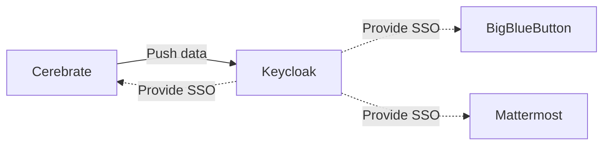
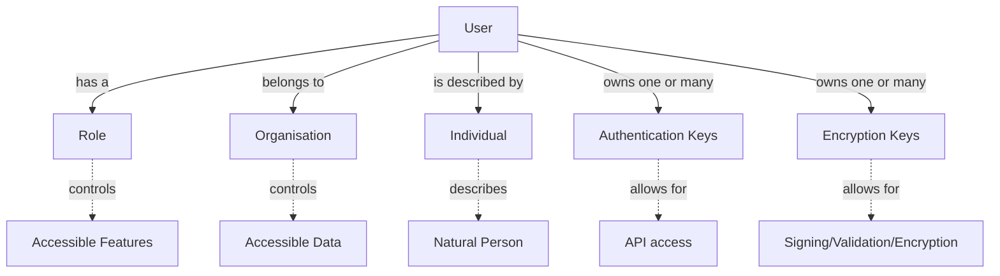

# Administration

## Keycloak integration

Cerebrate can be used in standalone mode, where it authenticates and manages its own users. This happens to be also the default configuration after installation, but you are not limited to leaving Cerebrate in this mode of operation.

By enabling Keycloak as your authentication provider, you can rely on Keycloak for authentications, whilst still benefiting from all the user management offered by Cerebrate.

This will lead to Cerebrate pushing changes to Keycloak and maintaining the state of your users.

- Users are **created in Cerebrate** and then automatically **provisioned in Keycloak**
- Other services (including Cerebrate) can **rely on keycloak for authentication** purposes
- **Cerebrate is the user management interface** to create users and revoke their access
    - Keycloak should not be access directly
- User permissions for other tools are managed via permission flags encoded as User Meta-fields in Cerebrate
    - Manage the available permissions

## Keycloak configuration

- As a first step, create a Realm with OpenID endpoint configuration
    - The realm's name is to be used by all other tools relying on Cerebrate's user management
    - The **Name** field will need to be reflected in Cerebrate as the **Realm Name**

- Add a Cerebrate client to your realm such as below
    - The Realm and Client name do not have to match as in the screenshots
    - The **Client ID** will need to be encoded as the **Client ID** in Cerebrate's keycloak configuration
    - Service accounts, Authorization and Direct Access Grants need to be enabled
    - Redirect URIs and the Base URL need to point to Cerebrate's baseurl as listed below (Valid redirect URIs are ``https://path.to.your.cerebrate/*`` whilst the base url is ``https://path.to.your.cerebrate``)

- Once the Client is added, some additional configurations have to be undertaken:
    - Under the Credentials section:
        - set **client authenticator** to `Cliend Id and Secret`
        - Generate a **secret** - this is to be encoded in cerebrate as the `Client Secret`
    - Under the Mappers section, add the following mappings:
        - **org_name**, **org_uuid**, **role_name**, **role_uuid**
        - make sure that all of the mappins look as the screenshot below:
        
    - Under Service Account Roles:
        - Make sure that under the "realm management" Client roles the following are enabled:
            - create-client
            - manage-clients
            - manage-users

## Cerebrate configuration

### Settings

The relevant settings can be accessed via Instance -> Settings -> Authentication

The relevant settings are shown below:

- **PasswordAuth** can be disabled to disallow any username/password authentications with Cerebrate directly and to rely fully on keycloak's authentication service.
- Once enabling Keycloak as an authentication provider, ensure that the configuration in the KeyCloak provider settings matches what you have configured in KeyCloak
- Some additional notes:
    - **Screw** allows for a bit of slack when it comes to timing differences between the KeyCloak server and the Cerebrate server. The default configuration of Cerebrate is to have a ms accurate match between the token and the client, which can block authentication in case of no ntp updates (due to whatever reason). Allowing for a bit of slack should avoid this potential issue.
    - **User Meta-field attribute mappings** allow for additional user permissions to be propagated as user attributes to keycloak. This means that other tools authenticating with keycloak have the possibility to allow/disallow access based on Cerebrate controlled settings. For more information on how to create meta-templates, see the User permission meta-template section. The data has to be stricly entered as a comma separated list.
    - Make sure that the **Baseurl** points to the authentication root of KeyCloak, which by default is ``/auth``. 

### Synchronisation script

Whilst Cerebrate will attempt to propagate any changes to users (creation/update/disabling) directly to KeyCloak when they are modified, in case of network outages, downtimes, manual modifications on KC's side or other errors, the two databases might drift apart and introduce discrepancies.

- To remedy this, Cerebrate includes a synchonisation script that can be invoked via the CLI. The intention of this script is to be executed periodically via **Crontab**.
- The script can be invoked via (assuming the default install path):
    - /var/www/cerebrate/bin/cake KeycloakSync
- To add it to crontab follow the following command instructions:
    - Enter crontab as your cerebrate user (typically your apache user such as www-data): `sudo crontab -u www-data -e`
    - Add an entry for the synchronisation script:
        - */15 * * * * /var/www/cerebrate/bin/cake KeycloakSync >/dev/null 2>&1
    - The above will execute the script every 15 minutes.
    - For more details on configuring crontab, rely on the [cron documentation](https://man7.org/linux/man-pages/man5/crontab.5.html)

## Administering users in Cerebrate

### Key concepts

- **Users** in Cerebrate purely deal with the access control and user permissions. In order to create a **User** we actually need to encode a **User**/**Individual**/**Role**/**Organisation** tuple. Whilst this may sound daunting at first, it's a rather straight forward process. Let's have a look at each of the moving parts involved:

### Individuals
- Every **User** is tied to a Cerebrate **Individual**
- **Individuals** are Contact database elements housing meta-information about a natural person, such as their name, e-mail address, etc
- **Individuals** can be created individually without the intent to attach a **User** to them. In this case they remain purely information data objects.
- If you wish to create an **Individual** to be used as a User, you can start by adding an **Individual** or create it in one-shot together with the **User** from the **User** add interface.
- Whilst creating/modifying **Users**, you'll have access to a small set of fixed fields as well as a set of custom defined **meta-fields** that are derived from **meta-templates**. These are optional, but powerful searchable / automatable data fields.

### Users
- Every **User** belongs to an **Organisation**
- Cerebrate **Organisations** describe either **legal** organisations or **virtual** organisations
- Data is owned by **Organisations** in Cerebrate, meaning that access control to sharing groups, organisation administrative data is restricted within the organisation boundaries
- You can either directly create a new **individual** or associate a **user** to be created with an existing one.
- Control additional **permissions to other tools** managed by Keycloak via the CNW permission **meta-template**

- **Users** have authentication information attached to them, in the form of a password (disabled when in KeyCloak only mode) and API keys

### Roles
- Cerebrate comes with a set of default roles, however we'll focus on the CNW specific roles below
- **Site administrators** are users with a special role attached, they transcend the above restrictions. Whilst they do belong to an organisation, they can administer any organisations' data. Only site administrators can encode **interconnections** with other Cerebrate nodes, **modify instance configurations**, and add elevated privilege users (**Team representatives**, **Team secondaries**, **Sync users**)
- **Team representatives** are the equivalent of Cerebrate Org administrators, they are regular users with some limited administrative powers in order to be able to **enroll** users in their own organisation, manage **users** in their team as well as their meta information and have limited **auditing** capabilities for their team members.
- **Team secondaries** are alternates to the **team representatives** and functionally carry the same powers.
- **Team members** can interact with the system, access data restricted to their team but have no administrative powers.
- **Sync users** are special users that can convey information between Cerebrate nodes. They come with elevated privileges in that they can modify data on behalf of other organisations.

### Authentication keys
- Are keys that can be created by **Users** for their own use
- They can be disabled when no longer in use. This is encouraged rather than removing them for **auditability**.
- Can be configured to **expire** on a given date
- Can and are encouraged to be **commented** for auditability. Creating individual keys for different integrations is considered best practice.
- Authentication keys, once created, **cannot be retrieved** again, so make sure that you note down the key when they are created.
- The first and last 4 characters are kept and displayed for easier **identification**.

### Cerebrate to Cerebrate synchronisation
- A **Cerebrate** with its eco-system (connected local tools, communities, etc) are called a **Brood** in Cerebrate
- **Broods** can interact with one-another via two exchange layers:
    - **Cerebrate** to **Cerebrate synchronisation**
    - **Local tool** to **Local tool native exchanges**
        - For example **MISP** to **MISP** synchronisation

- ** Adding a **Brood** is as simple as asking a partner to create a **sync user** for us on their **Cerebrate** instance and us doing the reverse for them.
    - Refer to the **User** section above to see how to create a user. Make sure that the **User** belongs to the **Organisation** that reflects the owner of the **cerebrate** node to be connected.
    - Make sure that the **Role** of the user is configured to be a **Sync User**
    - Either create an **Authentication key** for the partner **Cerebrate**'s **synchronisation user** and send it to them, or alternatively let them log into your instance via their **sync user** that you have created for them directly and create an **Authentication key** for themselves
- Once the API keys are exchanged, encode the Brood

- To validate the connection, run the connection test

- The above guide describes a 2-way synchronisation exchange, with that said **1-way exchanges** are also possible where only one party receives an API key from the other and encodes a brood.

## Sharing groups
- **Sharing groups** are containers for lists of **organisations**, to be used for granular information exchange via local tools. 
    - For example, a sharing group pushed to MISP can be used to create data for the CNW community only, or for subgroups thereof. 
- For more details on **Sharing groups** refer to the MISP documentation.

## Audit logs
- All actions that result in data creation or modification as well as authentication issues or encountered bugs end up in the various logging systems of Cerebrate
    - The build in Audit logs provide a searchable structured logging interface for all essential logs

    - These logs are also API exposed and can be searched as part of automatic remediation efforts
- Error logs, debug output and stack traces are stored in the /var/www/cerebrate/logs directory

## Enforcing tooling permission limits
- In some cases, encorcing additional limitations on the community, such as the number of allowed users in Mattermost, also are desired by communities with limited resources or accessed to under-provisioned services.
- To create such limitations, navigate to the **Permission limitations** interface (Instance -> Permission limitations)
    - Add rules that restrict permissions based on their scope (**global** and **organisation** specific scopes)

