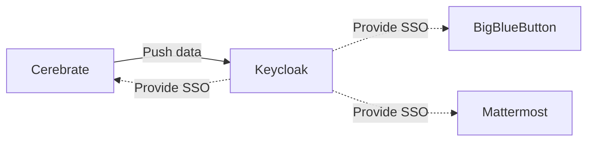

# Administration

## Keycloak integration

- Users are **created in Cerebrate** and then **provisioned to Keycloak**
- Other services (including Cerebrate) can **rely on keycloak for authentication** purposes
- **Cerebrate is the user management interface** to create users and revoke their access
    - Keycloak should not be access directly
