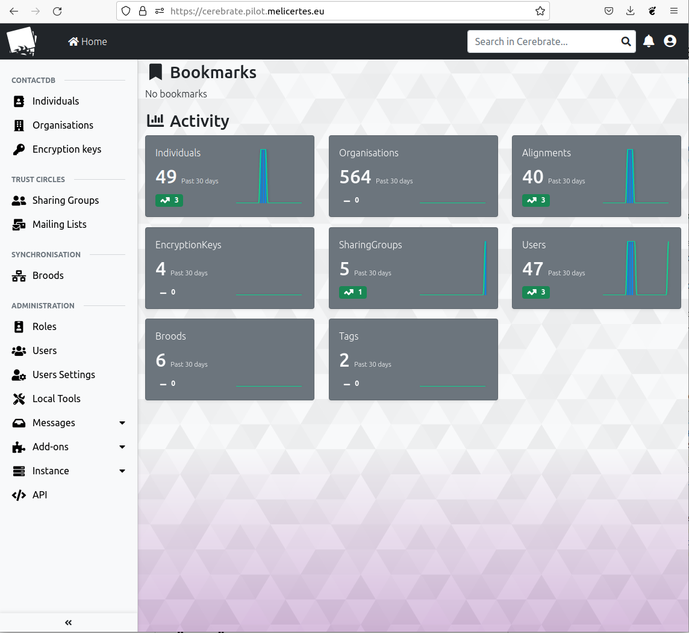

# Usage

## Main page and navigation

When login in Cerebrate, the user get a main page with some activity statistics. Depending of the role and permissions of the user, there are different items on the left menu such as:

- ContactDB management
- Trust Circles
- Synchronisation
- [Administration](/administration)

<figure markdown>

<figcaption>Overview page in Cerebrate when logged in</figcaption>
</figure>

The top menu includes a user setting link and a notification inbox.
