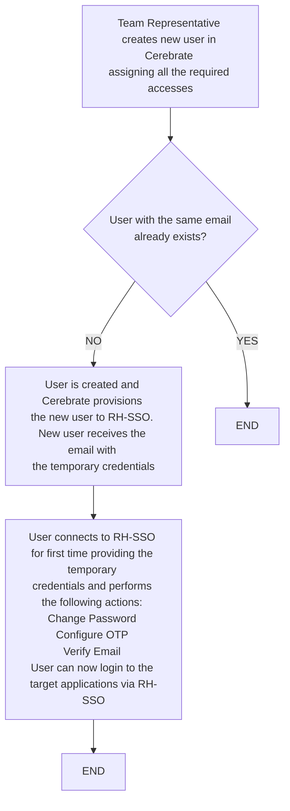

# IAM Process Diagrams

## Joiner 

Process that describes the flow when a new user is enrolled/on-boarded to the system.
A new user is created in Cerebrate by Team Representative and be provisioned to RH-SSO automatically. Team Representatives can be created in Cerebrate by the Administrators following the same flow. User has access to target applications automatically once he is logged in to RH-SSO. Any other accesses or permissions inside the application need to be assigned manually by the Application Administrator.



## Suspend

Process that describes the flow when a user should be disabled.
Administrators will be able to disable a user in Cerebrate after the period of six months of inactivity. The same process is followed for every user role (Administrator, Team Representative etc.). Administrators are able to disable Administrators. Application Administrator must disable the user manually in the target applications.

```mermaid
graph TD
    A[Administrator retrieves information <br>about user's activity from RH-SSO] --> B{User is inactive <br>for six months?}
    B --> |YES| D[Administrator connects to Cerebrate, <br>locate the user who is inactive <br>for six months and disable him]
    B -->|NO| C[END]
    D --> E[Cerebrate provisions the update for <br>the disable user to RH-SSO automatically]
    E --> F[Administrator connects to the target applications <br>to disable the user manually]
    F --> G[Disabled user cannot access the RH-SSO <br>and the target applications]
   G --> H[END]
 ```  
 
 ## Delete
 
Process that describes the flow when a user should be removed from the system at all.
Administrators will be able to remove a user at all from Cerebrate, only if the user has already been removed from RH-SSO. The same process is followed for every user role (Administrator, Team Representative etc.). 

**NOTE:** It is not recommended to delete a user at all from the system. It is preferred always to disable a user.

```mermaid
graph TD
    A[Administrator connects to Cerebrate <br>and locates the user that he wants to delete.] --> B[Administrator selects to delete the user <br>and a request is sent to RH-SSO <br>to validate if the user has been removed]
    B --> C{Positive response <br>from RH-SSO?}
    C -->|NO| D[Error message appeared in Cerebrate reporting <br>that the user cannot be deleted <br>from Cerebrate and RH-SSO]
    D --> E[END]
    C --> |YES| F[User is deleted from both <br>Cerebrate and RH-SSO successfully]
    F --> G[END]
 ```  
 
 ## Access Request
 
Process that describes the flow when a user needs and requests additional access to a resource.
User can only request an access to an additional application by contacting the Team Representative. Any other accesses or permissions inside the application need to be assigned manually by the Application Administrator. The same process is followed for every user role (Administrator, Team Representative etc.).

```mermaid
graph TD
    A[User contacts Team Representative <br>to request an access] --> B{Team Representative <br>approves the request?}
    B --> |YES| D[Team Representative connects to Cerebrate, <br>locates the user and assigns <br>to him the requested access]
    B -->|NO| C[END]
    D --> E[Cerebrate provisions the updated access to RH-SSO automatically. <br>Notification is sent to the Administrator for the assignment. <br>User can now access the requested application]
    E --> F[The Administrator of the target application assigns <br>to the user manually any other accesses/rights <br>that are needed inside the application]
    F --> G[END]
 ``` 


